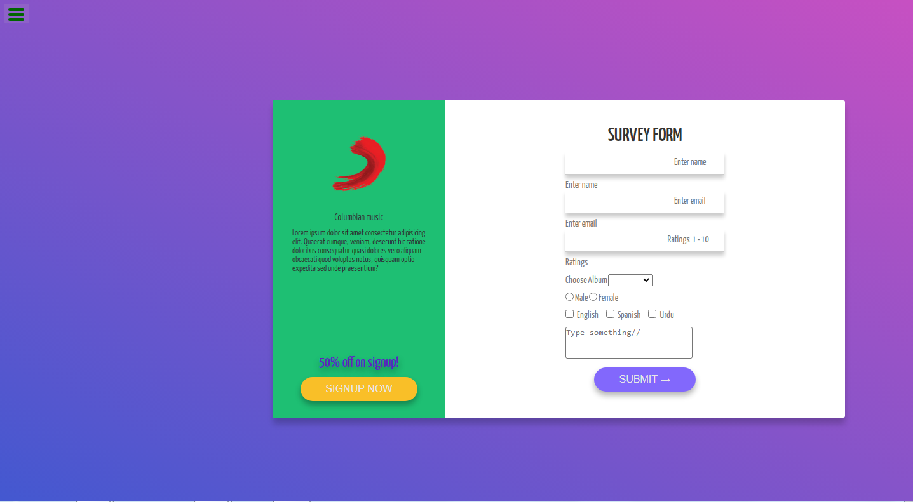

# FCC Test Suite Template

**Fork** this project (do not open a Pull Request) to start working on any of freeCodeCamp's responsive web design course projects. Select the project from the dropdown menu and run the tests to see which requirements your project is still missing.

You don't know how to fork a project? [Click hear](https://help.github.com/articles/fork-a-repo/) to learn how to do it.

# DEMO
checkout live demo here:https://ourandco.github.io/survey-form/

## Languages
- HTML5
- CSS3

## Author
:bust_in_silhouette: Alamgir
:bust_in_silhouette: Fernando

